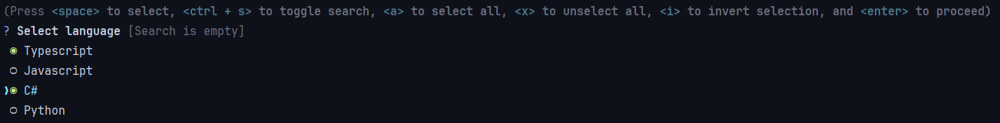

# Inquirer checkbox with search

## Install

```shell
npm i @vanyamate/inquirer-checkbox-with-search
```




## Usage

almost like default `checkbox`

```typescript
import inquirerCheckboxWithSearch from '@vanyamate/inquirer-checkbox-with-search';


inquirerCheckboxWithSearch({
    checkbox: {
        message : 'Select language',
        choices : [
            {
                value: '1',
                name : 'Typescript',
            },
            {
                value: '2',
                name : 'Javascript',
            },
            {
                value: '3',
                name : 'C#',
            }, {
                value: '4',
                name : 'Python',
            },
        ],
        required: true,
        theme   : {
            helpMode: 'always',
        },
    },
    input   : {},
});
```
        
